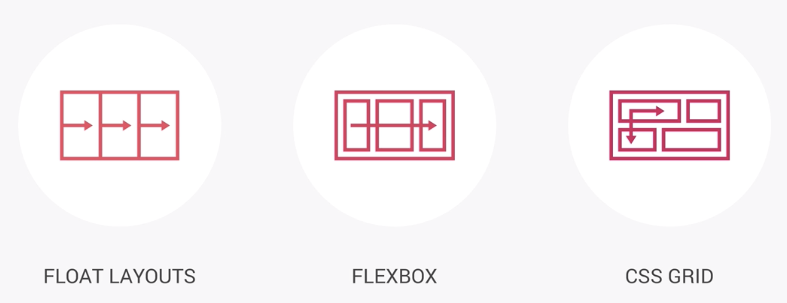

# CSS

> Write a lot of comments!  
> Use a lot of variables for CSS!

### 3 things to write good html and css

1. Responsive Design

   - Fluid grids and layouts
   - Media queries
   - Flexible / Responsive images
   - Correct units (ex. font sizes…)
   - Desktop-first vs mobile-first

2. Maintainable and scalable code

   - clean, Easy-to-understand, Growth, Reusable
   - How to organise files
   - How to name classes
   - How to structure HTML

3. Web performance
   - Less HTTP requests
   - Less code
   - Compress code
   - Use a CSS preprocessor
   - Less images
   - Compress images

### Basic responsive design principles

1. Fluid Grids and Layouts

   - To allow content to easily adapt to the current viewport width used to browse the website. Uses % rather than px for all layout-related lengths

2. Flexible / Responsive Images

   - Images behave differently than text content, and so we need to ensure that they also adapt nicely to the current viewport

3. Media Queries
   - To change styles on certain viewport widths (breakpoints), allowing us to create different version of our website for different widths

### Semantic?

Semantic means that we’re using the right HTML tag fro the right content.

### Layout Types



- Float Layouts (fully supported)

  - put a bunch of boxes side by side, using floats

- Flexbox

  - laying out elements in a one dimensional row

- CSS Grid

  - perfect for creating the overall layout of a page in a fully-fledged 2D grid

### Grid

A grid is a design system which allows us to build consistent interfaces.
The columns should be in a container, which we call a ‘row’.

### CSS Properties

- universal selector (\*)

  - select each and every element on the page, and then apply these declaration here to it

- box-sizing: ‘border-box’

  - to change the box model so that the borders and the paddings are no longer added to the total width or the total height that we specify for a box

- vh (viewport height)

  - The viewport is the user’s visible area of a web page. It varies with the device.

- background-position: top

  - The top part of the img sticks on the top of viewport, and the bottom part will be cropped. If it’s ‘center’, it crop out the top and bottom

- linear-gradient(to ‘where’, color1, color2)

  - color goes from color1 to color2. We can set ‘to right’ or ‘to left bottom’ to define which way it should go.
    +color picker 열어서 색 이름 클릭하면 hex나 rgb 등 컬러 형식 고를 수 있음.

- clip-path (modern css property)
  ex) clip-path: polygon(0 0, 100% 0, 100% 85%, 0 100%)

  - 네군데 좌표 설정해서 (왼쪽 위 코너부터 시계방향으로) 이미지 다각형화 하기. %는 해당 element 사이즈에 비례.
  - path 도우미로 웹사이트 “Clippy” 사용!

- img attribute ‘alt’

  - to describe the image for SEO(Search Engine Optimization), and for the case that somehow the image fails to load, then on the website this text appears

- transform: translate(-50%, -50%)

  - position: absolute를 사용하고 top, left 퍼센트 정하는 것은 parent element에 기초함. 하지만 transform, translate 쓰면 해당 element를 기준으로 할 수 있음.
  - translate(x, y)함수는 요소를 왼쪽부터 x거리만큼 상대적으로 위치를 정하거나 이동 및 재배치. y방향의 거리는 생략가능하나 이경우 y방향의 거리는 0이 됨.

- animation

  - `@keyframe <function name> {}` 지정하고, 원하는 css 클라스 명에 animation: 이름, 몇초인지, timing fn 등 지정.

- .btn:link (<- pseudo-class)

  - Pseudo-class is a special state of a selector.
    (Link is a special state of a selector when it’s an anchor element so it functions as a link)
  - ex) `::selection` : When user select the text

- max-width

  - If we have enough available space, then it will have the width that we specified, but if not(the viewport is smaller), then it will simply fill 100% of the available space.

- &:not(:last-child) {}

  - select everything except the last-child

- `width: calc((100% - #{$gutter-horizontal}) / 2);`
  calc() function

- [class^=“col-“] {}
  - ‘^’ allows us to select only the ones that start with ‘col-‘
    (“\*” mean is that select any classes which contain this part ‘col-‘)
    (‘\$’ mean is that select any classes which end with this part ‘col-‘)

* & > \*
  - select all the direct child (the first child that it comes across)/

```
  & > * {
    transform: skewY(7deg);
  }
```

- perspective
  The perspective property determines the distance between the z=0 plane and the user in order to give a 3D-positioned element some perspective.

  - The lower the value, more dramatic
  - user에게 어떻게 보이나.

- backface-visibility: hidden;

  - hide the back part of an element

- `<form action=“…” class=“form”>`
  - The ‘action’ is the script or the file, where we want the form to go as soon as we hit the submit button.
- `<label for =“…” >`
  - label의 ‘for’는 input field의 id 와 묶임. label을 클릭하면 label과 엮인 input field에 focus들어감.
- `<input type=“radio”>`
  - input type이 radio 일때 두가지의 radio input을 묶어서 하나만 선택되게 하려면 input name 설정을 같은 name으로 해야한다
- radio button 은 CSS로 스타일링 할 수 없음! 해결책은 ?
  - input field를 hidden 해놓고 label html text 안에 버튼 모양을 만들어서 l버튼 클릭시 선택되는 것처럼 하기! 왜냐면 label이 input과 묶여 있으면 label을 클릭해도 해당 input field가 선택되기 때문.

* element 를 상하좌우로 완전히 center 에 위치시키는 방법

  ```css
  position : absolute;
  top: 50%;
  left: 50%
  transform: translate(-50%, -50%);
  ```

## Ref.

> https://www.udemy.com/course/advanced-css-and-sass
