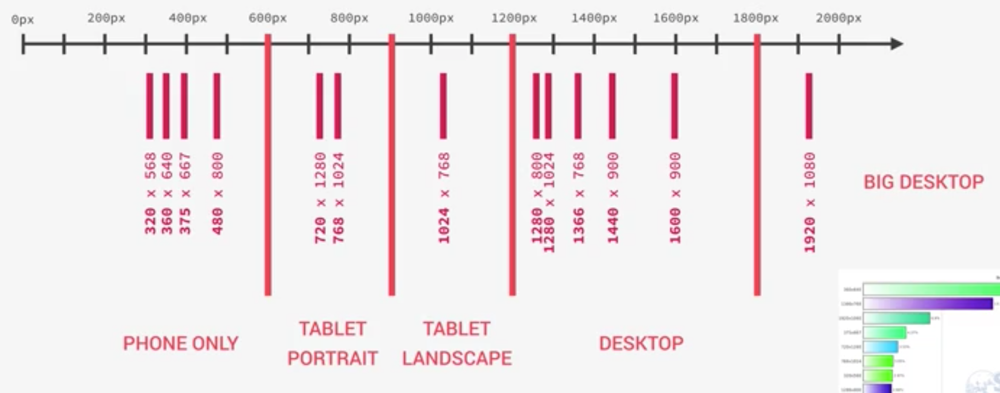

# Responsive Web

> With SASS  
> https://www.udemy.com/course/advanced-css-and-sass

### Responsive Design Strategies

1. Desktop-first
   - Start writing CSS for the desktop: Large Screen
   - Then, media queries shrink design to smaller screens.
   - `@media { max-width : 600px }`
2. Mobile-first
   - Start writing CSS for mobile devices: Small Screen
   - Then, media queries expand design to a large desktop screen
   - Forces us to reduce websites and apps to the absolute essentials
   - `@media { min-width : 600px }`

### Responsive Design Strategies : max-width / min-width

- `@media { max-width : 600px }` : Media query checks if the current vw (viewport width) is smaller or equal to 600px (to overriding specific parts of CSS for specific vw)

- 0px --- 600px --- 900px --- 1200px --- infinite

### Is mobile-first right for you?

1. PROS

   - 100% optimised for the mobile experience
   - Reduces websites and apps to the absolute essentials
   - Results in smaller, faster and more efficient products
   - Prioritized content over aesthetic design, which may be desirable

2. CONS
   - The desktop version might feel overly empty and simplistic
   - More difficult and counter-intuitive to develop
   - Less creative freedom, making it more difficult to create distinctive products
   - Clients are used to see a desktop version of the sites as a prototype
   - Do your users evcen use the mobile internet? What's the purpose of your website?

### Selecting our breakpoints : The options

1. BAD : use the specific devices widths. (such as Apple iPhone or iPad) (Easiest)
2. GOOD : get all the most-used devices and group them in a logical way and set the width
3. PERFECT : only look at the content and design. Get the design break points and adjust it (Difficult)



- How to set the media query with SASS?

  ```css
  /* 1. Set @minin */
  /*
    $breakpoint argument choices :
    - phone
    - tab-port
    - tab-land
    - big-desktop
    */

  @mixin respond($breakpoint) {
    @if $breakpoint == phone {
      @media (max-width: 37.5em) {
        // 600px
        @content;
      }
    }
    @if $breakpoint == tab-port {
      @media (max-width: 56.25em) {
        // 900px
        @content;
      }
    }
    @if $breakpoint == tab-land {
      @media (max-width: 75em) {
        // 1200px
        @content;
      }
    }
    @if $breakpoint == big-desktop {
      @media (max-width: 112.5em) {
        // 1800px
        @content;
      }
    }
  }

  /* 2. And use @mixin in other scss files */
  html {
    font-size: 62.5%;
    /* root font size - global definition. This defines what 1rem is */
    /* But in media query, 1rem is always following browser default */
    /* USE 'em' for media query */
    /* 1rem = 10px; 10px/16px = 62.5% */

    @include respond(big-desktop) {
      font-size: 75%; // 1rem =12px 12/16
    }
    @include respond(tab-land) {
      font-size: 56.25%; // 1rem = 9px 9/16
    }
    @include respond(tab-port) {
      font-size: 50%; // 1rem = 8px
    }
    @include respond(phone) {
      font-size: 50%; // @content로 mixin에 들어감
    }
  }
  ```
