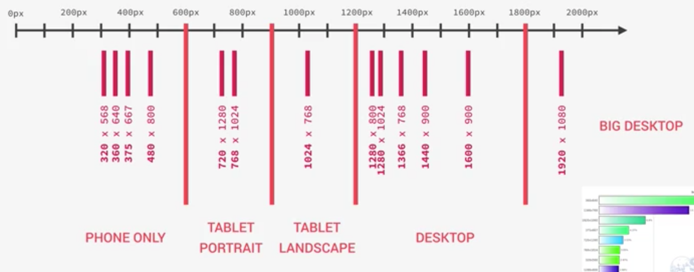
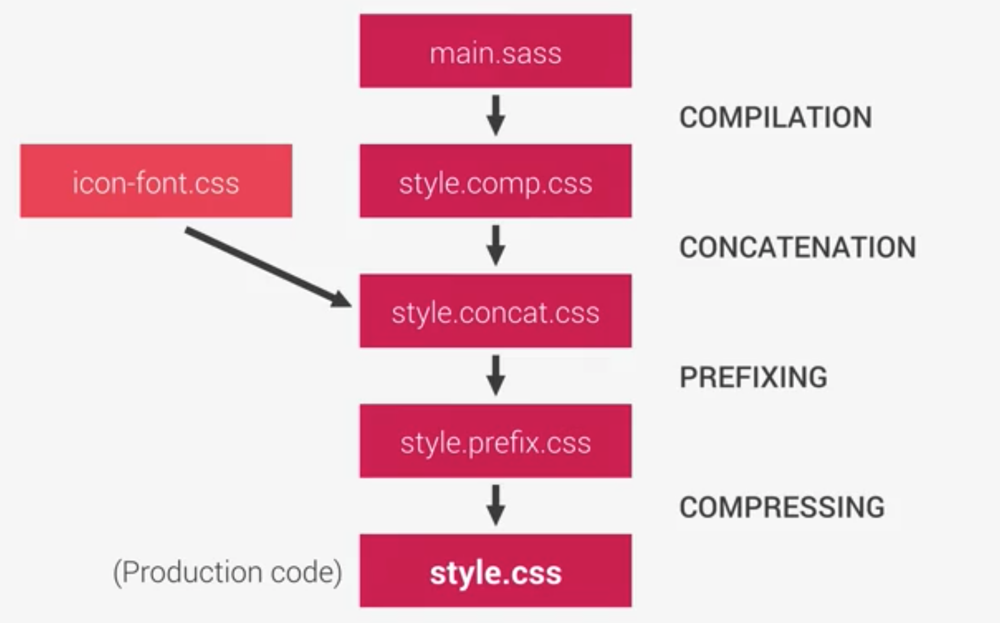

# Responsive Web

### Responsive Design Strategies

1. Desktop-first
   - Start writing CSS for the desktop: Large Screen
   - Then, media queries shrink design to smaller screens.
   - `@media { max-width : 600px }`
2. Mobile-first
   - Start writing CSS for mobile devices: Small Screen
   - Then, media queries expand design to a large desktop screen
   - Forces us to reduce websites and apps to the absolute essentials
   - `@media { min-width : 600px }`

### Responsive Design Strategies : max-width / min-width

- `@media { max-width : 600px }` : Media query checks if the current vw (viewport width) is smaller or equal to 600px (to overriding specific parts of CSS for specific vw)

- 0px --- 600px --- 900px --- 1200px --- infinite

### Is mobile-first right for you?

1. PROS

   - 100% optimised for the mobile experience
   - Reduces websites and apps to the absolute essentials
   - Results in smaller, faster and more efficient products
   - Prioritized content over aesthetic design, which may be desirable

2. CONS
   - The desktop version might feel overly empty and simplistic
   - More difficult and counter-intuitive to develop
   - Less creative freedom, making it more difficult to create distinctive products
   - Clients are used to see a desktop version of the sites as a prototype
   - Do your users evcen use the mobile internet? What's the purpose of your website?

### Selecting our breakpoints : The options

1. BAD : use the specific devices widths. (such as Apple iPhone or iPad) (Easiest)
2. GOOD : get all the most-used devices and group them in a logical way and set the width
3. PERFECT : only look at the content and design. Get the design break points and adjust it (Difficult)



- How to set the media query with SASS?

  ```css
  /* 1. Set @minin */
  /*
    $breakpoint argument choices :
    - phone
    - tab-port
    - tab-land
    - big-desktop
    */

  @mixin respond($breakpoint) {
    @if $breakpoint == phone {
      @media (max-width: 37.5em) {
        // 600px
        @content;
      }
    }
    @if $breakpoint == tab-port {
      @media (max-width: 56.25em) {
        // 900px
        @content;
      }
    }
    @if $breakpoint == tab-land {
      @media (max-width: 75em) {
        // 1200px
        @content;
      }
    }
    @if $breakpoint == big-desktop {
      @media (max-width: 112.5em) {
        // 1800px
        @content;
      }
    }
  }

  /* 2. And use @mixin in other scss files */
  html {
    font-size: 62.5%;
    /* root font size - global definition. This defines what 1rem is */
    /* But in media query, 1rem is always following browser default */
    /* USE 'em' for media query */
    /* 1rem = 10px; 10px/16px = 62.5% */

    @include respond(big-desktop) {
      font-size: 75%; // 1rem =12px 12/16
    }
    @include respond(tab-land) {
      font-size: 56.25%; // 1rem = 9px 9/16
    }
    @include respond(tab-port) {
      font-size: 50%; // 1rem = 8px
    }
    @include respond(phone) {
      font-size: 50%; // @content로 mixin에 들어감
    }
  }
  ```

### What are responsive images ?

- The goal of responsive images is to serve the right image to the right screen size and devices, in order to avoid downloading unnecessary large images on smaller screens.

### When to use responsive images : The 3 use cases

1. Resolution switching
2. Density switching (pixel density)
3. Art direction (Different image on smaller screen)

### `srcset` Attribute (Density Switching)

- Allows to browser to choose the best of two images below according to the screen.
- ``
- ```html
  

  <!-- src attribute : for the browser which doesn't support the others -->
  ```

### `<picture>` element (Art direction)

```html
<picture class="logo">
  <source
    srcset="img/logo-small-1x.png 1x img/logo-small-2x.png 2x"
    media="(max-width: 37.5em)"
  />
  
</picture>

<!-- in <source> element, we can use media query -->
```

### Responsive images in CSS

```css
@media (min-resolution: 192dpi) and (min-width: 37.5em), (min-width: 125em) {
  background-image: linear-gradient(
      to right bottom,
      rgba($color-primary-light, 0.8),
      rgba($color-primary-dark, 0.8),
      url(../img/hero.jpg);
}

/* to use bigger image on that media query condition */
```

### Testing for browser support (`@support`)

```css
@supports (
  -webkit-backdrop-filter: blur(10px) or (backdrop-filter: blur(10px))
) {
  -webkit-backdrop-filter: blur(10px);
  backdrop-filter: blur(10px);
  background-color: rgba($color-black, 0.3);
}
```

- @supports로 브라우저가 ()안의 css를 지원하면 {}안의 코드를 실행
- www.caniuse.com : to check browser support

### HTML `<meta>`

- This is needed for responsive web design

```html
<meta name="viewport" content="width=device-width, initial-scale=1.0" />
<meta http-equiv="X-UA-Compatible" content="ie=edge" />
```

### Touch Devices Support

```css
@media only screen and (max-width: 56.25em), only screen and (hover: none) {
}

/* If there's a hover effect in the website, we can specify the media query with (hover: none) and set another css appearance instead. */
```

### Build Process



```json
// Scripts //

  "scripts": {
    "watch:sass": "node-sass sass/main.scss css/style.css -w",
    "devserver": "live-server",
    "start": "npm-run-all --parallel devserver watch:sass",

    "compile:sass": "node-sass sass/main.scss css/style.comp.css",
    "concat:css": "concat -o css/style.concat.css css/icon-font.css css/style.comp.css",
    "prefix:css": "postcss --use autoprefixer -b 'last 10 versions' css/style.concat.css -o css/style.prefix.css",
    "compress:css": "node-sass css/style.prefix.css css/style.css --output-style compressed",

    "build:css": "npm-run-all compile:sass concat:css prefix:css compress:css"
  },
    // --parallel : To run all at the same time.
    //              Without this flag, it will run in a sequence

// DevDependencies //

  "devDependencies": {
    "autoprefixer": "^7.1.4",
    "concat": "^1.0.3",
    "node-sass": "^4.5.3",
    "npm-run-all": "^4.1.1",
    "postcss-cli": "^4.1.1"
  }
```

## Ref.

> https://www.udemy.com/course/advanced-css-and-sass
