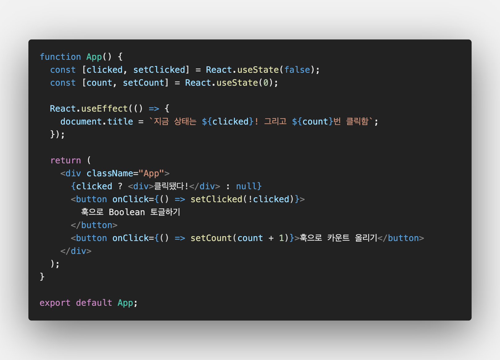

# React Hook

### 🤷🏻‍♀️React Hook이란?

- 함수형 리액트 컴포넌트에서 State를 사용할 수 있도록 해주는 기능
- React 16.8. 버전에서 공식으로 추가된 기능
- https://reactjs.org/docs/hooks-intro.html

### 💻이해용 예시 코드

📌 함수형 컴포넌트에 Hook을 사용했을 때

📌 Class형 컴포넌트를 사용했을 때

> 같은 동작 다른 코드 라인 수 🤖

---

### Hook의 기본 이해

- 기본적인 메소드는 `useState()`와 `useEffect()`

- `useState()`는 `state`와 state를 변화시키기 위한 함수를 return한다.

- `useEffect()`는 Component LifeCycle Method 중 `componentDidMount`와 `componentDidUpdate`와 같은 기능을 한다. 즉, 매 랜더링마다 실행됨!

- `useState()`는 argument로 initial state 값을 가진다.

- `state`를 변화시키기 위한 함수는 관습적으로 `set-`으로 네이밍. 이 함수는 `this.setstate()`와 같은 역할을 한다.

- 여러 개의 `useState()`로 하나 이상의 `state` 설정 가능

- 여러 개의 `useEffect()`로 하나 이상의 `Effect` 설정 가능

- `componentWillUnmount`로 특정 함수의 실행 등을 종료하고 메모리 누수를 막아야 할 경우, Hook에서는 `useEffect()`의 return 값으로 함수를 설정하여 이를 실행할 수 있다.

- Hook은 최상위 레벨에서만 실행되어야 한다. 루프나, 조건문이나 하위 함수에서 🚫
