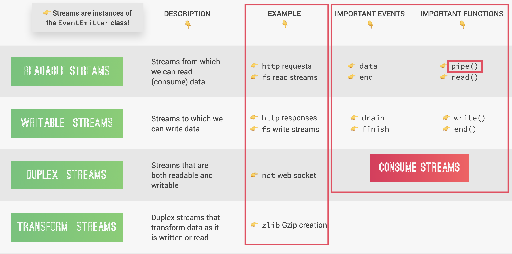

# How Node.js Works

### Node, V8, Libuv and C++

Node.js relys on ...

- V8 engine:
  - converts JS code into machine code that a computer can understand.
  - Written in JS and C++
- Libuv:
  - open source library with a focus on asynchronous I/O.
  - This gives Node access to the underlying computer operating system, file system, networking, and more.
  - Written in C++
  - Implements `event loop` and `thread pool`
  - cf. event loop: It's responsible for handling easy tasks like executing callbacks and network I/O while the thread pool is for more heavy work(ex. file access, compression..)
- http-parser, c-ares, OpenSSL, zlib ...

### Node Process and Threads

- Node is running on the single thread
- Process is a program in execution on a computer.
- "top-level" code = which is not a callback fn

- `Single Thread` (Sequence of instructions)

  1. Initialize program
  2. Execute 'top-level' code
  3. Require modules
  4. Register event callbacks
  5. Start event loop

- `Thread Pool`

  - works when there is too heavy task to run on the single thread. (provided by libuv library)
  - Additional 4 threads (or more)
  - Offload work from the event loop
  - Handle heavy(=expensive) tasks:
    - File system APIs
    - Cryptography
    - Compression
    - DNS lookups

- `Event Loop`

  - All the application code that is inside callback functions.
  - Node.js is build around callback
  - Event-driven architecture:
    - Events are emitted
    - Event loops picks them up
    - Callbacks are called
  - Event loop does orchestration
  - Loop order (tick)

    1. Start
    2. Expired timer callbacks
    3. I/O polling and callbacks
    4. setImmediate callbacks
    5. Close callbacks
    6. Any pending timers or I/O tasks? (yes or no)
       - Yes -> Exit program
       - No -> loop again from step 2)

    - `process.nextTick()`queue and `other microtasks` queue is executed right after every phases.  
      (nextTick happens before the next loop phase, and not the entire tick(loop itself))

- `I/O polling` : looking for new I/O events that are ready to be processed and putting them into the callback queue.

- `Don't Block!!` guide
  1. Don't use sync versions of functions in fs, crypto and zlib modules in your callback functions.
  2. Don't perform complex calculations (ex. loops inside loops)
  3. Be careful with JSON in large objects
  4. Don't use too complex regular expressions (ex. nested quantifiers)

### Event-driven Architecture

`Event emitter` -(emits events)-> `Event listener` -(calls)-> `Attached callback function`

```JS
const server = http.createServer();
server.on('request', (req, res) => {
    console.log('Request received');
})
```

- ^`server` is the instance of EventEmitter class
- Event listener keeps waiting and observing the subject that will eventually emit the event that the listenr is waiting for.

### Streams

- Used to process (read and write) data piece by piece (chunks), without completing the whole read or write operation, and therefore without keeping all the data in memory.

  - Perfect for handling large volumes of data, such as videos.
  - More efficient data processing in terms of memory (no need to keep all data in memory) and time (we don't have to wait until all the data is available)

    

### Node.js Module system

- Each JavaScript file is treated as a separate module
- Node.js usese the CommonJS module system: `require()`, `exports` or `module.exports`
- ES module system is used in browsers : `import`/`export`
- There have been attempts to bring ES modules to node.js (.mjs)
